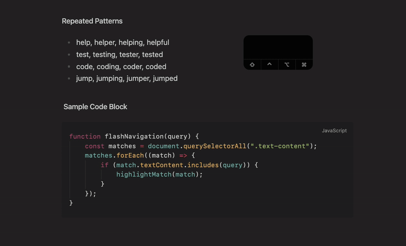

# Flash Navigation for Obsidian

A powerful navigation plugin for Obsidian that lets you quickly jump to any visible text using search labels and enhanced character motions. Inspired by flash.nvim and similar tools.

[](https://github.com/Erl-koenig/obsidian-flash-navigation/stargazers)
[](https://github.com/Erl-koenig/obsidian-flash-navigation/releases)
[](https://github.com/Erl-koenig/obsidian-flash-navigation/blob/master/LICENSE)
[](https://github.com/Erl-koenig/obsidian-flash-navigation/issues)
[](https://github.com/Erl-koenig/obsidian-flash-navigation/commits/main)



## Features

- **🔍 Smart Search**: Type characters to highlight matching text throughout your document
- **🏷️ Jump Labels**: Automatically assigns labels to matches for instant navigation
- **⚡ Fast Navigation**: Jump to any visible location with a single keypress
- **📊 Live Search Display**: Real-time status bar shows what you're typing as you search
- **🎨 Customizable Appearance**: Fully customizable colors and styling
- **📝 Precise Highlighting**: Only highlights the exact characters you've typed

## Installation

### From Obsidian Community Plugins

1. Open Obsidian Settings
2. Go to Community Plugins and disable Safe Mode
3. Click Browse and search for "Flash Navigation"
4. Install and enable the plugin

### Manual Installation

1. Download the latest release from GitHub
2. Extract the files to `VaultFolder/.obsidian/plugins/obsidian-flash-navigation/`
3. Reload Obsidian and enable the plugin in Settings

## Setup

### Basic Usage

Add a command to trigger flash navigation. You can use:

- Command Palette: Search for "Start Flash Navigation"
- Hotkey: Set a custom hotkey in Obsidian Settings > Hotkeys

### Vim Mode Setup (Recommended)

If you use Vim mode with the Vimrc plugin, add this to your `.obsidian.vimrc`:

```vim
" Unmap the default 's' command and remap to flash navigation
nunmap s
exmap flashNav obcommand flash-navigation:start-flash-navigation
nmap s :flashNav<CR>
```

## Usage

1. **Start**: Trigger the flash navigation command (e.g. `s` remap in vim mode or via hotkey)
2. **Search**: Type characters - matching text gets highlighted and your search query appears in the status bar with a ⚡ icon
3. **Jump**: Press a label character (a-z, A-Z, 0-9) to jump to that location
4. **Refine**: Continue typing to narrow down matches
5. **Exit**: Press `Escape` or `Backspace` until search is empty

### Example

```
1. Press 's' to start flash mode
2. Type "hel" - all instances of "hel" get highlighted and status bar shows "⚡ hel"
3. See labels: hel[a]lo, hel[b]p, hel[c]icopter
4. Press 'a' to jump to "hello"
```

**Behavior:**

- Uses specified label characters; if exhausted, fills remaining labels with `?`.
- Automatically exits flash mode if:
  - No matches are found (similar to flash.nvim)
  - `escape` is pressed
  - `backspace` is pressed until search is empty
  - Scrolling happens (mousewheel, scrollbar, etc.)
  - The active view changes (e.g. switching files)

## Customization & Colors

The plugin offers various customization options in Settings:

- **Search Behavior**: Case sensitivity and custom label characters
- **Visual Styling**: Colors and font weights for dimmed text and matches
- **Label Styling**: Appearance and position of jump labels
- **Status Bar Position**: Sets the position of the status bar item

### Color Customization

All colors are optional and will use your current Obsidian theme colors as defaults:

- **Dim Color**: Uses faint text color (for non-matching text)
- **Match Color**: Uses accent color (for highlighted matches)
- **Label Background**: Uses green color (for jump label backgrounds)
- **Label Text**: Uses inverted accent text color (for jump label text)
- **Question Mark Labels**: Uses yellow color (for overflow labels)

## Roadmap

Have a feature request? Open an issue on GitHub!

The following features are planned:

- Performance: Optimize for large documents (10,000+ lines)
- Support navigation for other elements (links, tables, callouts, ...)
- ...

## Contributing

Contributions are welcome! Please feel free to:

- Report bugs or request features via GitHub Issues
- Submit pull requests for improvements
- Share feedback and suggestions

## Acknowledgments

- Inspired by [flash.nvim](https://github.com/folke/flash.nvim) and [flash.vscode](https://github.com/cunbidun/flash.vscode)
- Built for the [Obsidian](https://obsidian.md) community
- Uses CodeMirror 6 decorations for precise text highlighting

## License

This project is licensed under the MIT License.

## Say Thanks

This plugin is developed by [Erl-koenig](https://github.com/Erl-koenig).

If you find this plugin helpful, consider supporting its development

[](https://www.buymeacoffee.com/erlkoenig)

[](https://github.com/sponsors/Erl-koenig)
